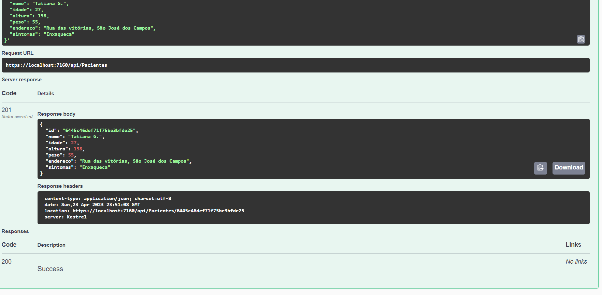

# Programação de Funcionalidades

Pré-requisitos: <a href="2-Especificação do Projeto.md"> Especificação do Projeto</a>, <a href="3-Projeto de Interface.md"> Projeto de Interface</a>, <a href="4-Metodologia.md"> Metodologia</a>, <a href="3-Projeto de Interface.md"> Projeto de Interface</a>, <a href="5-Arquitetura da Solução.md"> Arquitetura da Solução</a>

A API do projeto ATENSUS foi desenvolvida com ASPNET.Core e MONGO DB, respeitando os requisito de ser projetado com um banco de dados não relacional. 

Para tal, foi desenvolvido um banco para receber os dados dos Pacientes (usuários), que poderão cadastrar seus dados para entrar em uma fila da triagem.

Obedecendo assim o requisito: RF-001 - Os sistemas precisam permitir o cadastro de usuários	e RF-005 - Os sistemas devem apresentar uma lista de pessoas cadastradas para o atendimento	.

Além disso o banco compatibiliza com o requisito: RF-006- Os sistemas devem permitir salvar e adicionar informações relevantes do estado de saúde dos usuários	, uma vez que é posssível para o usuário cadastar seu estado de saúde e passará por uma validação do hospital onde registrará dados adicionais de saúde do mesmo, registrando assim, os dados no banco não relacional "hospital".

Imagem de referência do Banco de dados Paciente: 

   

Sendo assim, o projeto também contempla a RNF-005- Os sistemas precisam ser desenvolvidos usando uma API para acessar o banco de dados	 

> **Links Úteis**:
>
> - [Trabalhando com HTML5 Local Storage e JSON](https://www.devmedia.com.br/trabalhando-com-html5-local-storage-e-json/29045)
> - [JSON Tutorial](https://www.w3resource.com/JSON)
> - [JSON Data Set Sample](https://opensource.adobe.com/Spry/samples/data_region/JSONDataSetSample.html)
> - [JSON - Introduction (W3Schools)](https://www.w3schools.com/js/js_json_intro.asp)
> - [JSON Tutorial (TutorialsPoint)](https://www.tutorialspoint.com/json/index.htm)
